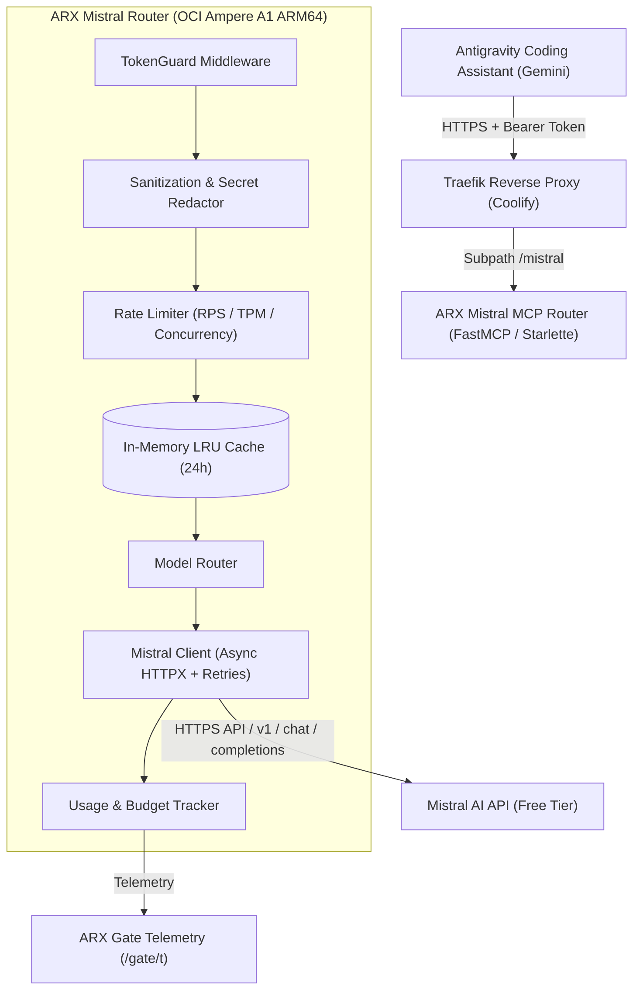

# ARX Mistral MCP Router — Architecture Specification

> Cost-optimized, secure MCP delegation gateway routing specialized tasks to Mistral AI free-tier models on OCI ARM64 infrastructure.

---

## 1. System Overview

The **ARX Mistral MCP Router** acts as an intelligent, stateless edge delegation service. It receives execution requests from Antigravity, sanitizes input payloads, enforces free-tier rate limits, checks a local cache for identical requests, routes to the appropriate Mistral model, and returns verified, structured JSON responses.

---

## 2. Core Components

| Component | Module | Responsibility |
|---|---|---|
| **FastMCP Server** | `src.arx_router.server` | Registers tools, schema definitions, and ASGI entrypoint |
| **TokenGuard** | `src.arx_router.auth` | Validates `Authorization: Bearer <token>` and handles `/healthz` + OAuth probe 404s |
| **Sanitizer & Redactor** | `src.arx_router.sanitization` | Redacts API keys/passwords/private keys, removes ANSI codes, compacts repeating log lines |
| **Rate Limiter** | `src.arx_router.rate_limiter` | Enforces 1.0 RPS, 60k TPM, concurrency limit (2), and exponential backoff with jitter on 429s |
| **Model Router** | `src.arx_router.model_router` | Maps task categories to models (`mistral-small`, `codestral`), suggests Gemini Pro when complexity is excessive |
| **Mistral Client** | `src.arx_router.mistral_client` | Async HTTP client with connection pooling, timeout handling, retries, and LRU cache |
| **Usage Tracker** | `src.arx_router.usage` | Tracks token usage per model, budget consumption, 429 counts, and estimated Gemini savings |

---

## 3. Tool Specifications & API Contracts

### 1. `mistral_extract`
- **Purpose**: Extract precise factual fields and citations from text.
- **Model**: `mistral-small-latest`
- **Contract**:
  - Input: `text` (str), `instructions` (str), optional `output_schema` (str)
  - Output: `{"extracted_evidence": ..., "source_references": [...], "notes": "...", "usage": {...}}`

### 2. `mistral_analyze_code`
- **Purpose**: Localized code inspection, logic error diagnosis, and refactoring advice.
- **Model**: `codestral-latest` (fallback `mistral-small-latest`)
- **Contract**:
  - Input: `code` (str), `question` (str), optional `constraints` (str)
  - Output: `{"findings": [...], "relevant_file_locations": [...], "recommended_changes": [...], "confidence": "high"|"medium"|"low", "uncertainty_notes": "...", "usage": {...}}`

### 3. `mistral_generate_tests`
- **Purpose**: Automated test generation covering edge cases and error branches.
- **Model**: `codestral-latest` (fallback `mistral-small-latest`)
- **Contract**:
  - Input: `code_or_module` (str), `framework` (str), `expected_behavior` (str)
  - Output: `{"proposed_tests": "...", "edge_cases_covered": [...], "assumptions": [...], "usage": {...}}`

### 4. `mistral_summarize_logs`
- **Purpose**: Compact diagnostic log summarization and root-cause analysis.
- **Model**: `mistral-small-latest`
- **Pre-processing**: Repetitive line deduplication, ANSI stripping, size bounding.
- **Contract**:
  - Input: `logs` (str), `objective` (str)
  - Output: `{"root_cause_candidates": [...], "relevant_errors": [...], "supporting_log_excerpts": [...], "recommended_checks": [...], "usage": {...}}`

### 5. `mistral_review_diff`
- **Purpose**: Advisory git diff review for regressions, missing tests, and security risks.
- **Model**: `codestral-latest`
- **Contract**:
  - Input: `diff` (str), `requirements` (str), optional `test_results` (str)
  - Output: `{"potential_regressions": [...], "security_or_reliability_concerns": [...], "missing_tests": [...], "suggested_fixes": [...], "usage": {...}}`

### 6. `mistral_usage`
- **Purpose**: Local token accounting, rate-limit event count, and budget status.
- **Contract**:
  - Input: none
  - Output: JSON breakdown by model (input/output tokens, requests, errors, 429 count), monthly budget % consumed, and estimated Gemini tokens saved.

---

## 4. Security Boundaries

1. **Authentication**: All endpoints (except `/healthz`) require a valid Bearer token configured via `MISTRAL_ROUTER_TOKEN` / `MISTRAL_ROUTER_TOKENS`.
2. **Secret Redaction**: Inputs and outputs pass through regex sanitizers stripping private keys, database connection credentials, and authorization headers.
3. **No Execution Privilege**: The server has NO shell execution, NO filesystem write access outside its temporary memory, and NO database admin credentials.
4. **OAuth Protection**: Returns 404 for `/.well-known/` and `/register` endpoints to block dynamic registration probe loops.

---

## 5. Free-Tier Quota & Rate Limit Protection

- **Concurrency Semaphore**: Default max 2 concurrent requests upstream.
- **Sliding Window Rate Limiter**: 1.0 request/second and 60,000 tokens/minute.
- **Budget Guard**: Default 1,000,000 tokens/month. If reached, calls fail safely with code `BUDGET_EXHAUSTED` instead of triggering paid billing.
- **HTTP 429 Handling**: Automatic exponential backoff with random jitter and `Retry-After` header extraction up to `MAX_RETRIES` (3).
- **Deterministic Cache**: 24-hour in-memory cache keyed by SHA-256 of `(model, prompt, sanitized_input)` to eliminate duplicate LLM calls.
